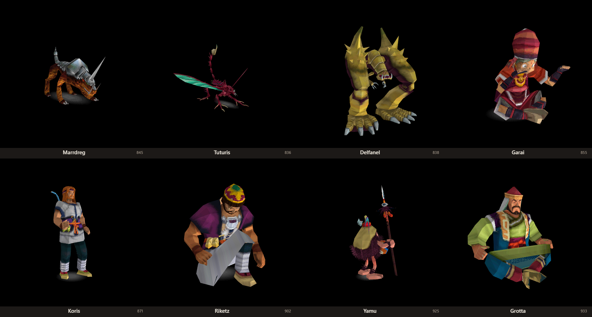
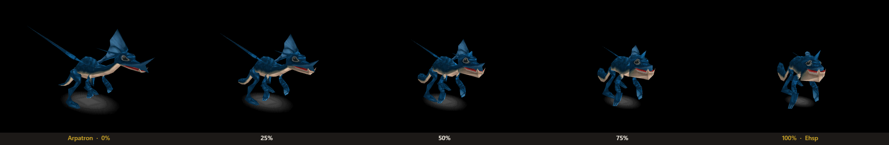
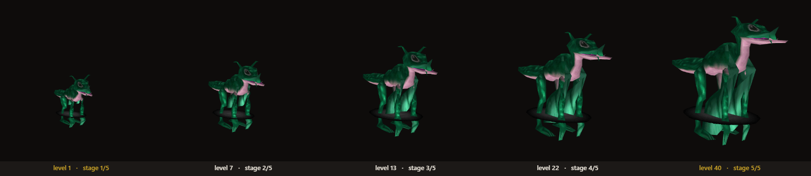

# Jade Cocoon RE

Reverse engineering of **Jade Cocoon: Story of the Tamamayu** (PS1, 1998, Genki / Crave,
`SLES-02201`). This repo holds the file-format documentation, the extraction and export
tools, and 106 exported character models.



The headline results:

- **Every model on the disc is exported.** 102 rigged, animated, textured GLB files plus 4
  unrigged OBJ, all named after the creature or NPC they actually are, straight into
  Blender with no plugin.
- **The formats are written down.** Archive, textures, mesh, skeleton, animation, the
  appearance blob, and how overlays hand a model its skeleton. See [docs/](docs/).
- **The merge is solved.** Jade Cocoon's defining mechanic, fusing two creatures into a
  third, is reproduced end to end: the per-vertex blend, the skeleton blend, the body-part
  rule, the ancestry-weighted recipe, and the hue-rotated palette. See
  [docs/MERGE_ALGORITHM.md](docs/MERGE_ALGORITHM.md).
- **You can drive it yourself.** A browser viewer for the exported models, and a live merge
  studio that blends any two creatures on a slider and writes out a GLB.

Nobody had published a working model export for this game. Now it exists.

## The merge

Jade Cocoon's whole identity is that you fuse two creatures and get a third. It turns out
the game stores no morph targets at all: **49 creatures share one exact vertex topology**,
so any two of them are already each other's morph targets, and merging is a per-vertex
`lerp` in fixed point. The skeleton blends the same way, body parts combine with an OR
rule, and the texture is not blended at all but selected from one parent and hue-rotated
by an angle derived from the elemental tallies.



Five steps of one blend, same rig and same animation frame throughout, so only the geometry
moves. Every step is a creature that does not exist on the disc. The rules are written up in
[docs/MERGE_ALGORITHM.md](docs/MERGE_ALGORITHM.md) and implemented in
`tools/merge_reference.py`, which self-tests against the game's own arithmetic.

## Quick start

### Look at the models in your browser

No install, no build step, no disc needed. From the repo root:

```bash
python -m http.server 8000
```

Then open <http://localhost:8000/viewer/>. Pick a creature from the list, scrub its
animations, toggle the skeleton, wireframe and the body parts the game hides. It parses the
GLBs itself with raw WebGL, so there is nothing to install and nothing phones home.

This is a **viewer**, not a merger. Its "Merged" tab holds files that were already blended
and written out by `merge_reference.py`; nothing in the browser is doing the blending. To
mix two creatures yourself, and watch it happen, use Merge Studio below.

### Open them in Blender

Drag any file from [`models/current/`](models/current) into Blender. They are ordinary
glTF binaries: rigged, skinned, textured, with every animation as a named action. Start
with `jc_0845_Marrdreg.glb`. [models/README.md](models/README.md) explains the naming and
the layout, including the `hidden_*` node groups that hold body parts the game does not
draw but a merge can switch back on.

### Merge two creatures yourself (Merge Studio)

The interactive one, and the only place the merge actually runs live. It needs your own
disc, because it reads the geometry, skeletons, animations and palettes straight out of it
and ships no game data of its own.

```bash
cd tools
python merge_studio.py ../extracted/SLES_022.01 ../extracted/DATA001_split --open
```

That serves a page on <http://127.0.0.1:8765/>. Pick a base creature on the left and a
material creature on the right, by name, out of the game's own 209-species roster. Then:

- **Blend** slides 0 to 100% and the creature morphs as you drag, animated, per vertex, in
  the same fixed-point arithmetic the PS1 used. The browser does the blending itself.
- **Age** runs level 1 to 40, which picks one of five growth stages and applies that
  stage's whole-body and per-bone scale ladders.
- **Palette** rotates the hue the way an elemental tally does, and you can take the texture
  from either parent.
- Body-part chips show which limb groups the merge switched on, since a wingless parent
  merged with a winged one gains wings.
- **export .glb** writes the result out, and that is exactly what `models/merged/` holds.



The age ladder above is Arpatron merged with Skawasp, the same creature at levels 1, 7, 13,
22 and 40 with the camera held still. Babies are not just smaller, they are re-proportioned:
the head keeps much more of its adult size than the body does. None of that is in the
exported files, which are all adults, so it is only visible in the live tool.

### Rebuild everything from your own disc

Nothing here needs a disc, but if you own the game and want to regenerate the export, or
run the live merge studio, or go digging yourself: dump your own copy to bin/cue and follow
"Rebuilding from scratch" in [docs/START_HERE.md](docs/START_HERE.md). Every tool takes the
path to your image as an argument. All Python 3, no dependencies, no packages to install.

```bash
cd tools
python iso_ls.py "/path/to/your/Jade Cocoon.bin" --json ../docs/iso_filelist.json
```

## What is in here

| folder | what |
|--------|------|
| [`docs/`](docs) | the research. `START_HERE.md` first, then `FINDINGS.md` for the full ledger. Every claim is marked CONFIRMED or HYPOTHESIS |
| [`tools/`](tools) | 42 Python scripts, zero dependencies: ISO reader, archive splitter, texture and mesh and animation parsers, the model exporter, the merge reference implementation, the live merge studio, plus headless Ghidra scripts |
| [`models/`](models) | the exported models. `current/` is the live export, `merged/` holds creatures that do not exist on the disc, `derived_experiment/` is an open problem |
| [`viewer/`](viewer) | the browser viewer. One HTML file and a generated index |

## Where to start reading

- **"I just want the models."** [`models/current/`](models/current), and
  [models/README.md](models/README.md) for what the filenames and the extra nodes mean.
- **"How does the file format work?"** [docs/MODEL_FORMAT.md](docs/MODEL_FORMAT.md) for
  mesh, skeleton and animation. [docs/OVERLAYS.md](docs/OVERLAYS.md) for how a model gets a
  skeleton, which is the least obvious part of the whole system.
- **"How does merging work?"** [docs/MERGE_ALGORITHM.md](docs/MERGE_ALGORITHM.md), then run
  `tools/merge_reference.py` which implements it and self-tests against the game's own
  fixed-point arithmetic.
- **"What is still unsolved?"** The "Open threads" section of
  [docs/START_HERE.md](docs/START_HERE.md). The biggest one is that five models have no
  skeleton anywhere on the disc, so they are exported on a rig that is too short.
- **"How do I dig into a PS1 game myself?"** The "Things that will bite you again" section
  of [docs/START_HERE.md](docs/START_HERE.md) is the honest version: every wrong turn, why
  it looked right, and what actually settled it.

## Known problems

These are export bugs we know about and have not fixed, all from the same root cause:

- `jc_0870_Kikinak`, `jc_0879_Mahbu`, `jc_0893_Poacher` and `jc_0930_Dream_Man` run their
  own animation clips on a rig that is too short. The first N bones land correctly and
  everything past N hangs off in space.
- `jc_0841_Cushidra` has no rig at all and ships as a static OBJ.
- `jc_0840_Seterian` wears model 836's 40-bone skeleton, the only 40-bone table there is.

Their real bone tables (24, 26 and 35 bones) are not on the disc. Deriving them from the
mesh was tried and is not good enough. [docs/OVERLAYS.md](docs/OVERLAYS.md) §7 has the
detail, and `models/derived_experiment/` has the attempt. If you want to contribute
something valuable, this is the thread.

## Legal

The game is Genki's. This repo documents its file formats and ships assets extracted from
a legally purchased copy, as a non-commercial preservation and interoperability project.
It contains **no game executable, no disc image, and no game code**. Please read
[NOTICE.md](NOTICE.md) before reusing anything, and note that the licence covers the code
and documentation only, never the game assets.

If you are a rights holder and want something removed, open an issue or contact the repo
owner and it will come down.

## Licence

Code and documentation: [MIT](LICENSE). Extracted game assets under `models/`: not covered,
see [NOTICE.md](NOTICE.md).
